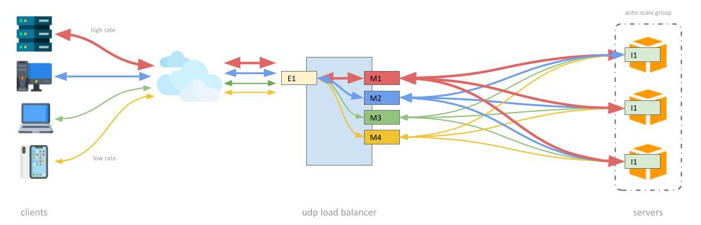

[](https://sonarcloud.io/dashboard?id=mlhpdx_SimplestLoadBalancer)
[](https://sonarcloud.io/dashboard?id=mlhpdx_SimplestLoadBalancer)
[](https://sonarcloud.io/dashboard?id=mlhpdx_SimplestLoadBalancer)
[](https://sonarcloud.io/dashboard?id=mlhpdx_SimplestLoadBalancer)
[](https://www.bestpractices.dev/projects/7796)

# Simplest UDP Load Balancer (slb) #

SLB is a sessionless load balancer for UDP traffic, and solves problems inherent with using traditional (feature rich) load balancers for such traffic. 



## Why? ##

For simple, stateless UDP protocols there is no advantage in trying to maintain "affinity" (aka. "sessions") between clients and back-end instances.  Traditional load balancers assume that affinity is helpful, and so they will try to route packets from a client to a consistent back-end server. By contrast, SLB evenly (randomly) distributes packets one-by-one over all available back-ends. This results in uniform loading of backends, and improved robustness when one backend instance fails (there will be an increase in packet loss for all clients rather than a total loss of traffic for some clients).

## Running SLB ##

By default SLB will listen on ports `1812` and `1813` for incomming UDP packets and relay them to random backend targets it knows. The ports it listens on can with the `--server-port-range` option, which accepts a single port (e.g. `541`) or a range of ports (e.g. `4000-5000`).

To make SLB aware of backends requires sending "watchdog" (aka. "keep alive") packets to the admin port (more on this below). By default the admin port is `1111`, but it can be configured using the `--admin-port` option.  If multiple network cards are present in your system, you can specify the IP using the `--admin-ip` option.  If the IP specified with `--admin-ip` is in the multicast CIDR range (`244.0.0.0/4`) SLB will automatically join that multicast group (more on this below).

Other options are described in the command help:

```
SimplestLoadBalancer:
  Sessionless UDP Load Balancer sends packets to backends without session affinity.

Usage:
  SimplestLoadBalancer [options]

Options:
  --server-port-range <server-port-range>          Set the ports to listen to and forward to backend targets
                                                   (default "1812-1813") [default: 1812-1813]
  --admin-ip <admin-ip>                            Set the IP to listen on for watchdog events [default is first private IP]
  --admin-port <admin-port>                        Set the port that targets will send watchdog events [default: 1111]
  --client-timeout <client-timeout>                Seconds to allow before cleaning-up idle clients [default: 30]
  --target-timeout <target-timeout>                Seconds to allow before removing target missing watchdog events [default: 30]
  --default-target-weight <default-target-weight>  Weight to apply to targets when not specified [default: 100]
  --unwise                                         Allows public IP addresses for targets [default: False]
  --stats-period-ms <stats-period-ms>              Sets the number of milliseconds between statistics messages printed to the 
                                                   console (disable: 0, max: 65535) [default: 1000]
  --default-group-id <default-group-id>            Sets the group ID to assign to backends that when a registration packet doesn't
                                                   include one, and when port isn't assigned a group [default: 0]
  --version                                        Show version information
  -?, -h, --help                                   Show help and usage information
```

## Making SLB Aware of Backends ##

Backends aren't configured at the command line. Rather, they are dynamically registered and de-registered using periodic UDP packets sent to the admin port (`--admin-port`). The content of those packets may differ based on how you use SLB in your environment.

### Single SLB ### 

If you're running a single SLB server, backends can be configured to send packets to that one IP and on the admin port. This is the simplest scenario. Each backend will send messages with two "magic bytes" to indicate "backend registration" for content:

```
0x11 0x11
```

SLB will interpret such a packet as "register the sender as a backend".  Optionally, the messages can contain one or two additional bytes (weight and group ID) whose purpose will be discussed in more detail below.

```
0x11 0x11 [X] [X]
           ^   ^
           |   |
           |  one byte for group id
           |
          one byte for weight
```

### SLB with Management Server

In some environments registration packets won't be sent from backends themselves, and SLB supports such use cases. When a registration packet is sent from a "third party" the content will need to include the IP address of the backend being registered:

```
0x11 0x11 X X X X [X] [X]
          ^        ^   ^
          |        |   |
          |        |  one byte for group id
          |        |
          |       one byte for weight
          |
          four bytes for ip to add
```

Again, the weight and group ID bytes may optionally be appended.

### SLB in a High Availability Environment
 
When a more robust HA deployment with multiple SLBs is needed the communication between backends and SLB can be simplified by using a multicast group IP. This is helpful since each SLB must be aware of each backend. In such a case the SLB servers should make use the `--admin-ip` option to specify a multicast address which will cause the SLBs to join the multicast group and hence all receive any message sent to that IP. The backends can be configured with that single IP, minimizing their workload and simplifying their configuration (particularly when SLBs are rotated in and out of service due to autoscaling and/or the use of spot instances). 

Note that using a multicast IP requires either a switch that supports multicast, or (more likely) running in an AWS VPC configured with a [multicast domain](https://docs.aws.amazon.com/vpc/latest/tgw/tgw-multicast-overview.html).

## Registration and De-registration Packet Formats

The admin packet formats are very simple as of version 2.0. In the simplest single-SLB use case a registration packet from a backend may consist of nothing more than two magic bytes (`0x11` `0x11`). Optionally, the packets can come from a different source (e.g. a management server) and incude four  bytes to specify the ipv4 address of a backend. In either case, two additional optional bytes for traffic "weight" relative to other backends, and for the "group" to assign to the backend may be appended (more about groups below). In ASCII art:

```
0x11 0x11 [X X X X] [X] [X]
           ^         ^   ^
           |         |   |
           |         |  one byte for group id
           |         |
           |        one byte for weight
           |
          four bytes for ip to add
```

To immeadiately remove a target send a packet with `0x86` as the first byte instead of `0x11` (if sent from a management server, append the IP of the backend to remove):

```
0x86 0x11 [X X X X]
           ^
           |
          four bytes for ip to remove
```

## Backend Weights

Weights are used to control the relative amount of traffic delivered to each backend.  If no weight is specified the default value of 100 (configurable with `--default-target-weight`) will be applied to the backend, and each will receive the same volume of packets. That said, it's expected (and advisable) that backends tune the weight value in their admin packets based on their ability to handle traffic (perhaps reduced when CPU is high, updates are being applied, etc.). For example:

- If three backends are known to an SLB with weights of `100`, `50` and `50`, respectively, then the first will receive 50% of the traffic and the second and third will each get 25%.
- If two backends are known to an SLB with weights of `31` and `31`, respectively, then each will receive 50% of the traffic.

When using groups, the relative weights are evaluated versus other backends in the same group (not accross all groups).

> It's important to send admin packets reliably and at a sufficient cadence.  Each time an packet is received by SLB the backend's "last seen" time is updated. If 30 seconds (configurable with `--target-timeout`) passes without a backend being seen, it is removed and no further traffic will be sent to it. 

## Backend Groups ##

By default, all backends will be used to service all ports served by the load balancer. 

However, it's possible to assign individual ports to subsets of backends using SLB port assignment messages and providing group IDs in registration messages.  Consider, for example, that you would like to have SLB load balance traffic for ports 1812-1813 but assign the traffic reaching each port to a different set of servers. To do so:

- Send port assignment messages (magic bytes `\x66 \x11`) with a port number (two bytes) and a group ID (one byte). These messages need not be repeated, and can be sent when a change to port group assignments is desired (there is no harm in repeating them, however, which can be convenient to ensure the ports are correctly assigned groups after service restarts). 
- Add the appropriate group ID to registration messages for the two sets of backends.

```
0x66 0x11 X X X
          ^   ^
          |   |
          |  one byte for group ID
          |
         two bytes for port number, litten endian 
```

## Sending Admin Packets with Bash ## 

Using Linux `bash` it's straightforward to send admin packets. This can be done using the `netcat` (aka. `nc`) command or the `/dev/udp` filesystem. For example, if your load balancer is listening on the default admin port `1111` and you want to add a target with the IP `192.168.1.22`:

```bash
$ echo -e $(echo  "\x11\x11$(echo "192.168.1.22" | tr "." "\n" | xargs printf '\\x%02X')") > /dev/udp/127.0.0.1/1111
```

Since it can be tedius to manually send those packets to keep a set of targets registered, you might create a small shell script, say `lb.sh`:

```bash
#!/bin/bash
echo -ne $(echo  "\x11\x11$(echo "192.168.1.22" | tr "." "\n" | xargs printf '\\x%02X')") > /dev/udp/127.1.1.1/1111
echo -ne $(echo  "\x11\x11$(echo "192.168.1.23" | tr "." "\n" | xargs printf '\\x%02X')") > /dev/udp/127.1.1.1/1111
echo -ne $(echo  "\x11\x11$(echo "192.168.1.24" | tr "." "\n" | xargs printf '\\x%02X')") > /dev/udp/127.1.1.1/1111
echo -ne $(echo  "\x11\x11$(echo "192.168.1.25" | tr "." "\n" | xargs printf '\\x%02X')") > /dev/udp/127.1.1.1/1111
echo -ne $(echo  "\x11\x11$(echo "192.168.1.26" | tr "." "\n" | xargs printf '\\x%02X')") > /dev/udp/127.1.1.1/1111
echo -ne $(echo  "\x11\x11$(echo "192.168.1.27" | tr "." "\n" | xargs printf '\\x%02X')") > /dev/udp/127.1.1.1/1111
```

And then use the `watch` command to call that script every few seconds:

```bash
$ watch -n10 ./lb.sh
```

## Building ##

Pre-built binaries for Linux and Windows x64, and Linux ARM are available as GitHub "Releases". This is a very simple .Net 8.0 project, so to build it run (assuming you have dotnet-sdk-8.0 installed):

```
dotnet build
```

You'll probably want to generate a native binary executable, which is convenient and offers some performance benefits. 

For Linux:

```
dotnet publish -o ./ -c Release -r linux-x64 /p:PublishSingleFile=true /p:PublishTrimmed=true --self-contained
```

For Windows:

```
dotnet publish -o ./ -c Release -r win10-x64 /p:PublishSingleFile=true /p:PublishTrimmed=true --self-contained
```

Likewise, it's simple to run using `dotnet run` in the project directory:

```
$ dotnet run
```

Or, if you've built a native executable:

```
$ ./SimplestLoadBalancer
```

## Reporting Issues ##

Please feel free to [create issues](https://github.com/mlhpdx/SimplestLoadBalancer/issues) here on GitHub for questions and bug reports. There is no template provided, or requirements but please try to be as descriptive as possible - it will help ensure we are able to respond in a sensible way. See also, [contributing]().

Enjoy!
