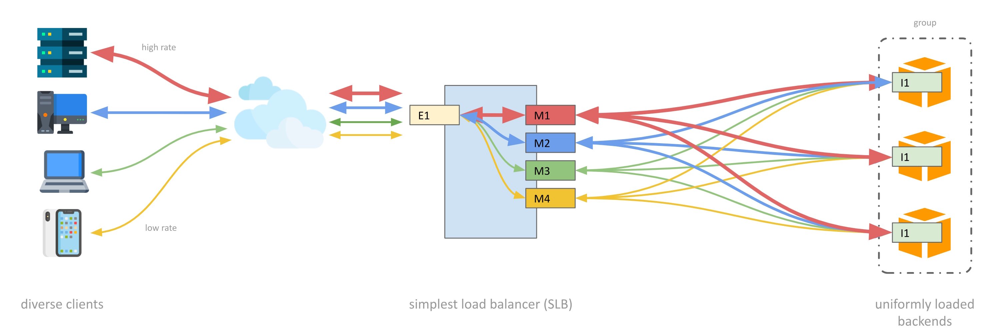

[](https://sonarcloud.io/dashboard?id=mlhpdx_SimplestLoadBalancer)
[](https://sonarcloud.io/dashboard?id=mlhpdx_SimplestLoadBalancer)
[](https://sonarcloud.io/dashboard?id=mlhpdx_SimplestLoadBalancer)
[](https://sonarcloud.io/dashboard?id=mlhpdx_SimplestLoadBalancer)

# Simplest UDP Load Balancer (slb) #

SLB is a sessionless load balancing of UDP traffic and solves problems inherent with using traditional (for feature rich) load balancers for such traffic. 



## Why? ##

For simple, stateless UDP protocols there is no advantage in trying to maintain "affinity" (aka. "sessions") between clients and back-end instances.  Traditional load balancers assume that affinity is helpful, and so they will try to route packets from a client to a consistent back-end server. By contrast, SLB evenly (randomly) distributes packets one-by-one over all available back-ends. This results in uniform loading of backends, and improved robustness when one backend instance fails (there will be an increase in packet loss for all clients rather than a total loss of traffic for some clients).

## Running SLB ##

By default SLB will listen on ports `1812` and `1813` incomming UDP packets and will relay them one to one of the backend targets it knows. The ports it listens on can with the `--server-port-range` option, which accepts a single port (e.g. `541`) or a range of ports (e.g. `4000-5000`).

To make SLB aware of backends requires sending "watchdog" (aka. "keep alive") packets to the admin port (more on this below). By default the admin port is `1111`, but it can be configured using the `--admin-port` option.  If multiple network cards are present in your system, you can specify the IP using the `--admin-ip` option.  If the IP specified with `--admin-ip` is in the multicast CIDR range (`244.0.0.0/4`) SLB will automatically join that multicast group (more on this below).

Other options are described in the command help:

```
SimplestLoadBalancer:
  Sessionless UDP Load Balancer sends packets to backends without session affinity.

Usage:
  SimplestLoadBalancer [options]

Options:
  --server-port-range <server-port-range>            Set the port to listen to and forward to backend targets (default "1812-1813")
  --admin-port <admin-port>                          Set the port that targets will send watchdog events (default 1111)
  --client-timeout <client-timeout>                  Seconds to allow before cleaning-up idle clients (default 30)
  --target-timeout <target-timeout>                  Seconds to allow before removing target missing watchdog events (default 30)
  --default-target-weight <default-target-weight>    Weight to apply to targets when not specified (default 100)
  --unwise                                           Allows public IP addresses for targets (default is to only allow private IPs)
  --version                                          Show version information
  -?, -h, --help                                     Show help and usage information
```

## Making SLB Aware of Backends ##

Backends can't be setup at the commandline. To add and maintain backend targets, periodic UDP packets must be sent to the admin port (`--admin-port`). There are a couple things to consider here:

- If you're running a single SLB server then backends can be configured to send packets to that one IP and port.
- When a more robust HA deployment with multiple SLBs is needed, the backends should be configured to send admin packets to each so that all the SLBs are aware of each backend. That can be cumbersome when SLB servers are rotated in and out of service (e.g. when using autoscaling or spot instances).  In such a case the SLB servers should make use of the option to configure a multicast IP with `--admin-ip` which will cause the SLBs to join the same multicast group. This way the backends can be configured with a single IP and packets will automatically be delivered to all SLB servers (yay, networking!). Of course, this requires that you have a switch that supports multicast, or are running in an AWS VPC configured with a [multicast domain](https://docs.aws.amazon.com/vpc/latest/tgw/tgw-multicast-overview.html).

The admin packet format is very simple as of version 2.0. A packet from a backend to SLB may consist of nothing more than two magic bytes (`0x11` `0x11`). Optionally, the packets can come from a different source (e.g. a management server) and incude four more bytes to specify the ipv4 address of a backend. In either case, two additional optional bytes for traffic "weight" relative to other backends, and for the "group" to assign to the backend may be appended (more about groups below). In ASCII art:

```
0x11 0x11 [X X X X] [X] [X]
           ^         ^   ^
           |         |   |
           |         |  one byte for group id
           |         |
           |        one byte for weight
           |
          four bytes for ip to add
```

Weights are used to control the relative amount of traffic delivered to each backend.  If no weight is specified the default value of 100 (configurable with `--default-target-weight`) will be applied to the backend, and each will receive the same volume of packets. That said, it's expected (and advisable) that backends tune the weight value in their admin packets based on their ability to handle traffic (perhaps reduced when CPU is high, updates are being applied, etc.). For example:

- If three backends are known to an SLB with weights of `100`, `50` and `50`, respectively, then the first will receive 50% of the traffic and the second and third will each get 25%.
- If two backends are known to an SLB with weights of `31` and `31`, respectively, then each will receive 50% of the traffic.

It's important to send admin packets reliably and at a sufficient cadence.  Each time an packet is received by SLB the backend's "last seen" time is updated. If 30 seconds (configurable with `--target-timeout`) passes without a backend being seen, it is removed and no further traffic will be sent to it. 

To immeadiately remove a target send a packet with `0x86` as the first byte instead of `0x11` (if sent from a management server, append the IP of the backend to remove):

```
0x86 0x11 [X X X X]
           ^
           |
          four bytes for ip to remove
```

## Backend Groups ##

By defaults, all backends will be used to service all ports served by the load balancer. However, it's possible to assign individual ports to subsets of backends using port assignment message and providing group IDs in registration messages.  Consider, for example, that you would like to have SLB load balance traffic for ports 1812-1813 but assign the traffic reaching each port to a different set of servers. To do so:

- Send port assignment messages (magic bytes `\x66 \x11`) with a port number (two bytes) and a group ID (one byte). These messages need not be repeated, and can be sent only when a change to port group assignments is desired (there is no harm in repeating them, however, which can be convenient to ensure the ports are correctly assigned groups after service restarts). 
- Add the appropriate group ID to registration messages for the two sets of backends.

```
0x66 0x11 X X X
          ^   ^
          |   |
          |  one byte for group ID
          |
        two bytes for port number, litten endian 
```


## Sending Admin Packets with Bash ## 

Using Linux `bash` it's straightforward to send admin packets. This can be done using the `netcat` (aka. `nc`) command or the `/dev/udp` filesystem. For example, if your load balancer is listening on the default admin port `1111` and you want to add a target with the IP `192.168.1.22`:

```bash
$ echo -e $(echo  "\x11\x11$(echo "192.168.1.22" | tr "." "\n" | xargs printf '\\x%02X')") > /dev/udp/127.0.0.1/1111
```

Since it can be tedius to manually send those packets to keep a set of targets registered, you might create a small shell script, say `lb.sh`:

```bash
#!/bin/bash
echo -ne $(echo  "\x11\x11$(echo "192.168.1.22" | tr "." "\n" | xargs printf '\\x%02X')") > /dev/udp/127.1.1.1/1111
echo -ne $(echo  "\x11\x11$(echo "192.168.1.23" | tr "." "\n" | xargs printf '\\x%02X')") > /dev/udp/127.1.1.1/1111
echo -ne $(echo  "\x11\x11$(echo "192.168.1.24" | tr "." "\n" | xargs printf '\\x%02X')") > /dev/udp/127.1.1.1/1111
echo -ne $(echo  "\x11\x11$(echo "192.168.1.25" | tr "." "\n" | xargs printf '\\x%02X')") > /dev/udp/127.1.1.1/1111
echo -ne $(echo  "\x11\x11$(echo "192.168.1.26" | tr "." "\n" | xargs printf '\\x%02X')") > /dev/udp/127.1.1.1/1111
echo -ne $(echo  "\x11\x11$(echo "192.168.1.27" | tr "." "\n" | xargs printf '\\x%02X')") > /dev/udp/127.1.1.1/1111
```

And then use the `watch` command to call that script every few seconds:

```bash
$ watch -n10 ./lb.sh
```

## Building ##

This is a very simple .Net 7.0 project, so to build it run (assuming you have dotnet-sdk-7.0 installed):

```
dotnet build
```

You'll probably want to generate a native binary executable, which is convenient and offers some performance benefits. 

For Linux:

```
dotnet publish -o ./ -c Release -r linux-x64 /p:PublishSingleFile=true /p:PublishTrimmed=true --self-contained
```

For Windows:

```
dotnet publish -o ./ -c Release -r win10-x64 /p:PublishSingleFile=true /p:PublishTrimmed=true --self-contained
```

Likewise, it's simple to run using `dotnet run` in the project directory:

```
$ dotnet run
```

Or, if you've built a native executable:

```
$ ./SimplestLoadBalancer
```

Enjoy!
